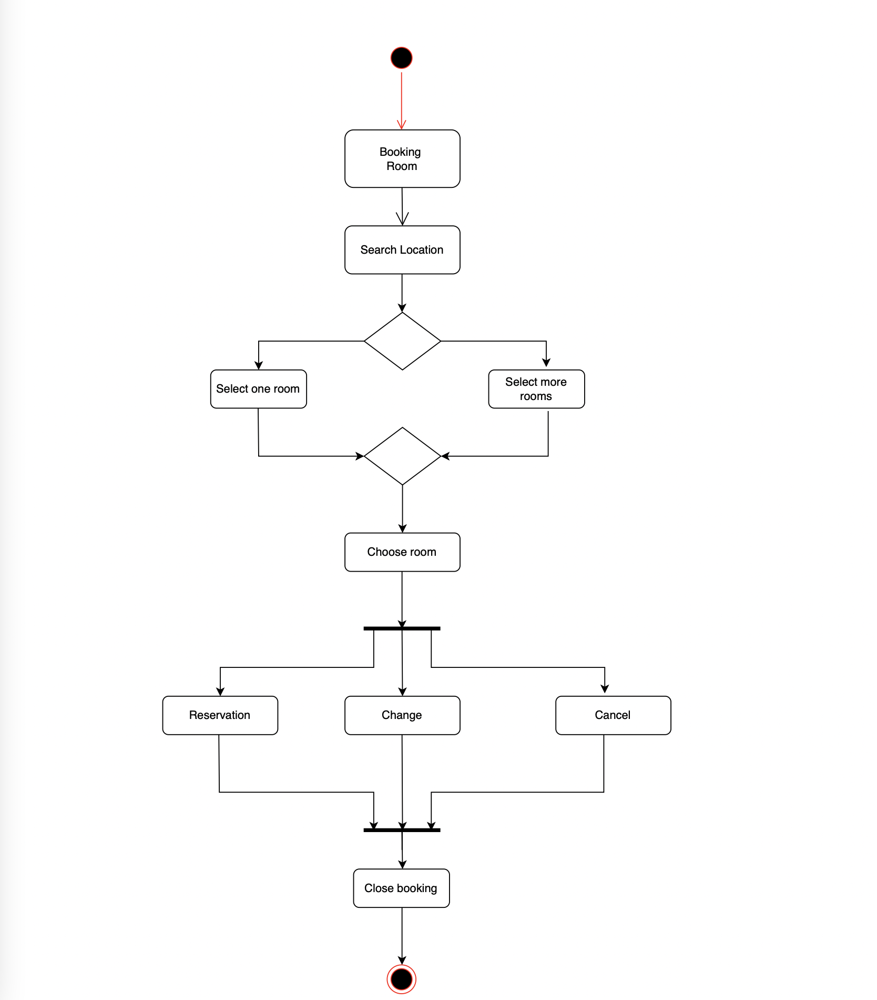
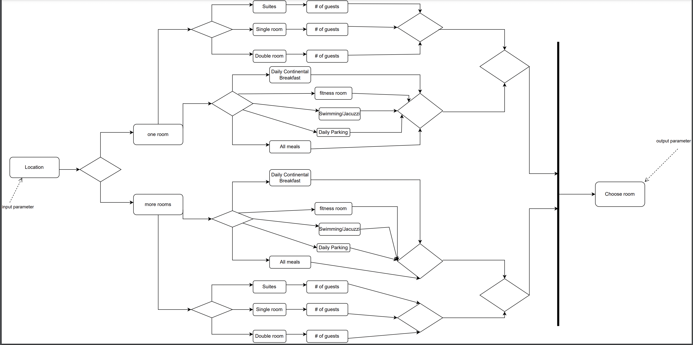
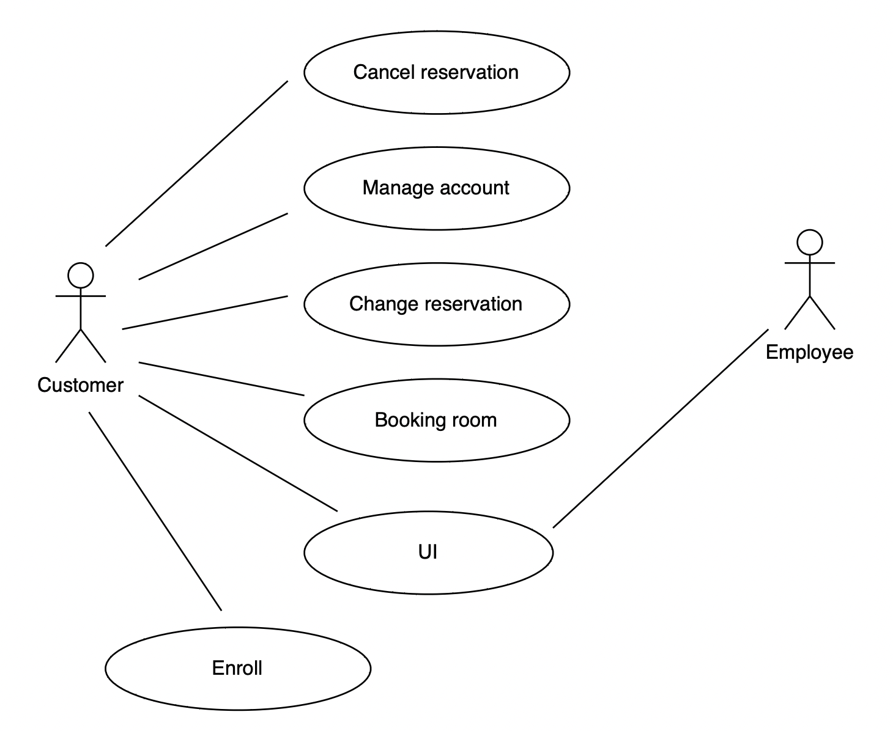
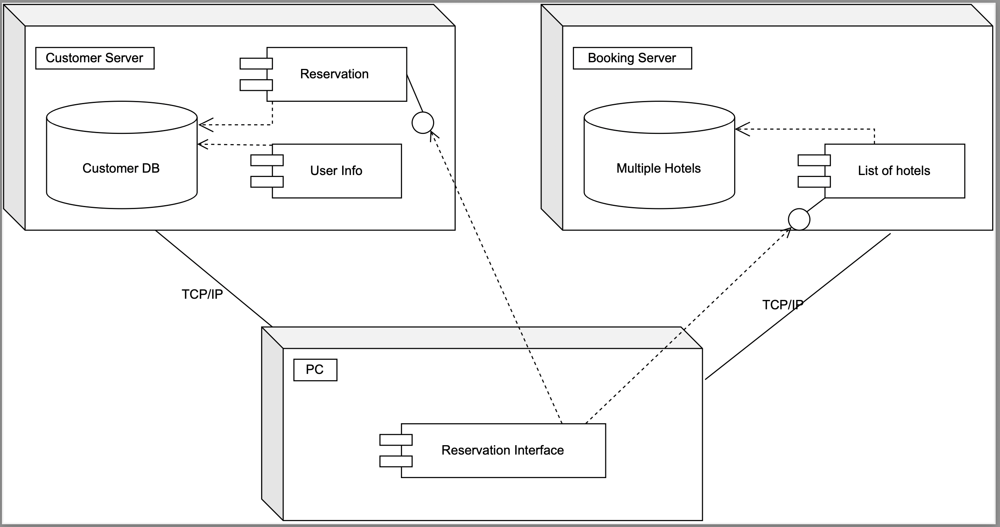

# Hotel Reservation System
## team-project-scrum-tious-bunch

## Team Members
1. Ganesh Nehru (Backend Development)
3. Dylan Zhang (Frontend and Backend Development)
4. Lingxiang Hu (Frontend Development)
5. Janmejay Bhavsar (Backend Development)

## Design decisions
- Frontend - HTML, CSS, and React JS
- Backend - Java Spring boot (maven)
- Database - Heroku(ClearDB)
- Server - Heroku
- UI - Material UI

## Run application
- Step 1 : Clone the repository from master branch.
- Step 2 : Open Intelij IDEA or Eclipse IDE to run the Backend code
- Step 3 : Open VS Code to run the Frontend code
- Step 4 : Change directory to the client folders.
- Step 5 : Run the command "npm install" to install node_modules (Maybe need to install - npm install @mui/material @emotion/react @emotion/styled @mui/icons-material packages).
- Step 6 : Run the command "npm start" to run the application on your local.
- Step 7 : Open Intelij or Eclipse
- Step 8 : Change directory to the HotelReservationSystem
- Step 9 : Right click the HotelReservationSystem folder and select "Run as" -> "Maven Build" to run the backend

## Scrum Meetings
- First three Sprint - Friday 8pm, Saturday 2pm
- Last three Sprint - Tuesday 8pm or Wednesday 8pm (depends on teammate's schedule), Friday 8pm, (not required Satruday 8pm)

## Team's GitHub Repo
https://github.com/gopinathsjsu/team-project-scrum-tious-bunch

## Sprint sheet + Burndown Chart
https://docs.google.com/spreadsheets/d/1xPB8XDcltDRmCIP2fTOnfPpFRrfEpqVzSKR50EKPtkg/edit?usp=sharing
https://github.com/gopinathsjsu/team-project-scrum-tious-bunch/blob/master/Burndown_Chart.PNG

## Feature Set
### Customer
1. Register
2. Log in and Log out
3. Search location
4. Booking room (signle, double, suite)
5. Dynamic price apply to date and the number of guest
6. payment
7. Earn Loyalty points
8. Check order history
9. Make change of your booking
10. Cancel booking

### Admin
1. Authenticate Admin identity
2. Display all reservations in admin page

## Contributions Summary
### Ganesh Nehru:
Designed database architecture and implemented Hotel, Reservation, Customer, Admin and Signup entities in backend, as well as all of their functionalities. 

### Dylan Zhang: 
Designed and implemented all functionality APIs in SingupScreen, LongInScreen, HomeScreen, UserprofileScreen, AdminScreen, and redesigned BookingResultScreen and CheckoutScreen based on Lingxiang's design for Frontend. Created Backend Admin API, part of Reservation and Customer API. Created Activity diagram, Sub Activity diagram, Use Cases diagram, and Deployment diagram.

### Lingxiang Hu:
Designed the booking, bookingresult screen of the frontend, implement the API to get the data from backend, Deployed the project in heroku and fix some deploy bugs.

### Janmejay Bhavsar:
Implemented the Dynamic Pricing feature for the Hotel Reservation System. Also, helped implement the Hotel, Reservation, Customer, Admin and Signup entities in the backend. 
## Architecture Diagram

### Activity diagram

### Sub Activity diagram

### Use Cases diagram

### Deployment diagram

## Project board
https://github.com/orgs/gopinathsjsu/projects/19

## XP Values
1. Communication
2. Simplicity
3. Feedback
4. Courage
5. Respect

## Project Journal
### Date: (2/25/22)
Owner: Dylan Zhang\
Task: Create Home page header in frontend.\
Status: Completed\
Next task: Create Login page in frontend.

### Date: (2/26/22)
Owner: Ganesh Nehru\
Task: Create wireframe for Home and Reservation page.\
Status: Completed\
Next task: Create wireframe for Login, Manage Booking, and Manage Rewards pages.

### Date: (2/25/22)
Owner: Dylan Zhang\
Task: Create Login page in frontend.\
Status: Completed\
Next task: Registration page in frontend. 

### Date: (2/27/22)
Owner: Ganesh Nehru\
Task: Create wireframe for Login, Manage Booking, and Manage Rewards pages.\
Status: Completed\
Next task: Create database design for project.

### Date: (2/28/22)
Owner: Dylan Zhang\
Task: Create Registration page in frontend.\ 
Status: Completed\
Next task: Create carousel feature in homepage.

### Date: (2/28/22)
Owner: Ganesh Nehru\
Task: Create database design for project.\
Status: Completed\
Next task: Implement Customer and Reservation functionality in backend.

### Date: (3/1/22)
Owner: Ganesh Nehru
Task: Implemented Customer and Reservation functionality in backend.\
Next task: Implement Signup functionality in backend.\
Status: Completed\
Blockers: Hotel, Room, and Amenity functionality in backend (Owner: Janmejay Bhavsar)

### Date: (3/2/22)
Owner: Janmejay Bhavsar\
Task: Implement Hotel, Room, and Amenity functionality in backend.\
Status: Completed\
Next task: TBD

### Date: (3/2/22)
Owner: Lingxiang Hu\
Task: Create booking screen.\
Status: Completed.\
Next task: BookingResult screen

### Date: (3/4/22)
Owner: Dylan Zhang\
Task: Create Login page for employees in frontend.\
Status: Completed\
Next task: Implement Registration API call from backend.\
Blockers: Booking screen (Owner: Lingxiang Hu)

### Date: (3/7/22)
Owner: Dylan Zhang\
Task: Implement registration API call in frontend.\
Status: Completed\
Next task: testing registration method - frontend

### Date: (3/8/22)
Owner: Dylan Zhang\
Task: testing registration method - frontend\
Status: Completed\
Next task: implement login API call - frontend

### Date: (3/16/22)
Owner: Dylan Zhang\
Task: implement login API call - frontend\
Status: Completed\
Next task: testing login method - frontend

### Date: (3/17/22)
Owner: Dylan Zhang\
Task: testing login method - frontend\
Status: Completed\
Next task: create user profile page

### Date: (3/23/22)
Owner: Ganesh Nehru\
Task: Create fake data for database and insert queries for Hotel and Rooms table.\
Status: In progress\
Next task: TBD

### Date: (4/2/22)
Owner: Ganesh Nehru\
Task: Re-implement Customer, Reservation, Hotel, Room and Amenity entities.\
Status: Completed\
Next task: TBD

### Date: (4/2/22)
Owner: Lingxiang Hu\
Task: Create BookingResult screen and waiting Booking screen data.\
Status: Completed\
Next task: Checkout screen

### Date: (4/2/22)
Owner: Lingxiang Hu\
Task: Create Checkout screen and waiting BookingResult screen data.\
Status: Completed\
Next task: Confirmation screen

### Date: (4/2/22)
Owner: Lingxiang Hu\
Task: Create Confirmation screen and waiting Checkout Screen data.\
Status: Completed\
Next task: Implement api in Booking screen

### Date: (4/14/22)
Owner: Ganesh Nehru, Janmejay Bhavsar\
Task: Create fake data for Hotel, Room, and Amenity tables.\
Status: In progress\
Next task: Finish creating fake data for Hotel, Room, and Amenity tables and fix structure of insertion queries. 

### Date: (4/15/22)
Owner: Ganesh Nehru\
Task: Create and correct structure of fake data for Hotel, Room, and Amenity tables for proper insertion.\
Status: Completed\
Next task: Implement get, post, delete and update APIs for Customer, Reservation, Hotel, Room and Amenity entities.

### Date: (4/19/22)
Owner: Ganesh Nehru\
Task: Implement get, post, delete and update APIs for Customer, Reservation, Hotel, Room and Amenity entities.\
Status: Completed\
Next task: create user profile page

### Date: (4/20/22)
Owner: Dylan Zhang\
Task: Create admin login API - backend\
Status: Completed\
Next task: Create admin login API - frontend

### Date: (4/23/22)
Owner: Dylan Zhang\
Task: Create admin login API - frontend\
Status: Completed\
Next task: Create admin page - frontend

### Date: (4/24/22)
Owner: Ganesh Nehru\
Task: Create wireframe for Login, Manage Booking, and Manage Rewards page.\
Status: Completed\
Next task: Restructure Hotel table to include Rooms and Amenities.

### Date: (4/26/22)
Owner: Lingxiang Hu\
Task: Redesign the Booking screen and waiting api.\
Status: In progess\
Next task: Implement API in Booking screen

### Date: (4/27/22)
Owner: Ganesh Nehru\
Task: Merge Hotel, Room, and Amenity tables. Implement get function to retrieve customer by first name, last name, and email.\
Status: Completed\
Next task: TBD

### Date: (4/28/22)
Owner: Ganesh Nehru\
Task: Added get functionality to retrieve hotel by its city.\
Status: Completed\
Next task: TBD

### Date: (4/28/22)
Owner: Dylan Zhang\
Task: Create Activity diagram, Deployment diagram, and Use cases for frontend.\
Status: Completed\
Next task: TBD

### Date: (5/1/22)
Owner: Lingxiang Hu\
Task: Implement API in Booking screen.\
Status: Completed\
Next task: Render data from API in BookingResult screen

### Date: (5/1/22)
Owner: Lingxiang Hu\
Task: Render data from API in BookingResult screen.\
Status: Completed\
Next task: Redesign the checkout screen

### Date: (5/2/22)
Owner: Dylan Zhang\
Task: Changing Customer's backend API and database, and will test Customer talbe after revservation method done.\
Status: Completed\
Next task: Create display order section in Customer's profile page and Employee's

### Date: (5/3/22)
Owner: Dylan Zhang\
Task: Create display order section in Customer's profile and Admin's page. \
Status: Completed\
Next task: TBD

### Date: (5/3/22)
Owner: Dylan Zhang\
Task: Store Customer Information into database and redesigned Booking Result screen and Confirmation screen. \
Status: Completed\
Next task: Implement Reservation method with calling backend reservation API, and store data to database.

### Date: (5/4/22)
Owner: Dylan Zhang\
Task: Implement Reservation method with calling backend reservation API, and store data to database. \
Status: Completed\
Next task: TBD

### Date: (5/4/22)
Owner: Lingxiang Hu\
Task: Create new design of the checkout screen. \
Status: Completed\
Next task: Complete the function of checkout screen

### Date: (5/4/22)
Owner: Dylan Zhang\
Task: Display Reservation Order in Customer page \
Status: Completed\
Next task: TBD

### Date: (5/6/22)
Owner: Ganesh Nehru\
Task: Implement getReservationiBySignupID, createCustomer, and createReservation methods. \
Status: Completed\
Next task: TBD

### Date: (5/6/22)
Owner: Dylan Zhang\
Task: Display Reservation Order in Admin page \
Status: Completed\
Next task: Created getAllReservations frontend and backend API and created APIs for getting specific customer info with customerID in frontend and backend

### Date: (5/7/22)
Owner: Dylan Zhang\
Task: Created getAllReservations frontend and backend API and created APIs for getting specific hotel info with hotelID in frontend and backend  \
Status: Completed\
Next task: Create delete functionality for customer and test delete and update backend API

### Date: (5/8/22)
Owner: Dylan Zhang\
Task: Create getCustomerById backend api for getting specific customer info, and then to display customer info in Admin page when Employee click info icon \
Status: Completed\
Next task: TBD

### Date: (5/8/22)
Owner: Dylan Zhang\
Task: Create delete functionality in user profile page for the order can be canceled by customer and created get customer by id backend api \
Status: Completed\
Next task: Trying to implement update order api and fixing bugs or create DB in AWS and deploy project in Heroku.

### Date: (5/9/22)
Owner: Dylan Zhang\
Task: Create Update method and test both backend and frontend api call \
Status: Completed\
Next task: create DB in AWS and deploy project in Heroku.

### Date: (5/10/22)
Owner: Janmejay Bhavsar\
Task: Created dynamic pricing for number of guests. \
Status: Completed\
Next task: TBD

### Date: (5/11/22)
Owner: Dylan Zhang\
Task: Implement dynamic price method and store changed guest number and price value into DB after Customer select max guest \
Status: Completed\
Next task: Changed display information in Customer and Admin page after Customer booked room.

### Date: (5/11/22)
Owner: Dylan Zhang\
Task: Changed display information in Customer and Admin page after Customer booked room. \
Status: Completed\
Next task: 

### Date: (5/11/22)
Owner: Janmejay Bhavsar\
Task: Created dynamic pricing for weekend. \
Status: Completed\
Next task: TBD

### Date: (5/11/22)
Owner: Lingxiang Hu\
Task: Deploy the frontend in heroku, little modify for package.json. \
Status: Completed\
Next task: Deploy the backend in heroku, bug repair. 

### Date: (5/13/22)
Owner: Lingxiang Hu\
Task: Deploy the backend in heroku, add system.propertoes file. \
Status: Completed\
Next task: Test webpage and fix some memory bug. 
