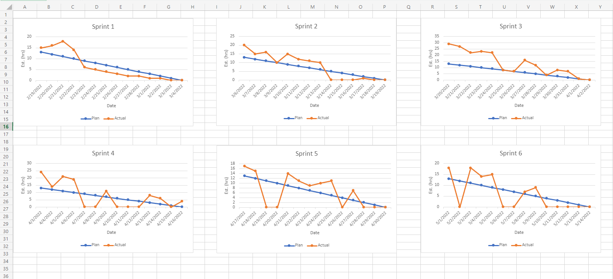

# Hotel Reservation System

## Design decisions
- Frontend - HTML, CSS, and React JS
- Backend - Java Spring boot (maven)
- Database - Heroku(ClearDB)
- Server - Heroku
- UI - Material UI

## Run application
- Step 1 : Clone the repository from master branch.
- Step 2 : Open Intelij IDEA or Eclipse IDE to run the Backend code
- Step 3 : Open VS Code to run the Frontend code
- Step 4 : Change directory to the client folders.
- Step 5 : Run the command "npm install" to install node_modules (Maybe need to install - npm install @mui/material @emotion/react @emotion/styled @mui/icons-material packages).
- Step 6 : Run the command "npm start" to run the application on your local.
- Step 7 : Open Intelij or Eclipse
- Step 8 : Change directory to the HotelReservationSystem
- Step 9 : Right click the HotelReservationSystem folder and select "Run as" -> "Maven Build" to run the backend

## Burndown Chart

## Feature Set
### Customer
1. Register
2. Log in and Log out
3. Search location
4. Booking room (signle, double, suite)
5. Dynamic price apply to date and the number of guest
6. payment
7. Earn Loyalty points
8. Check order history
9. Make change of your booking
10. Cancel booking

### Admin
1. Authenticate Admin identity
2. Display all reservations in admin page

## Architecture Diagram

### Activity diagram

### Sub Activity diagram

### Use Cases diagram

### Deployment diagram

## XP Values
1. Communication
2. Simplicity
3. Feedback
4. Courage
5. Respect
